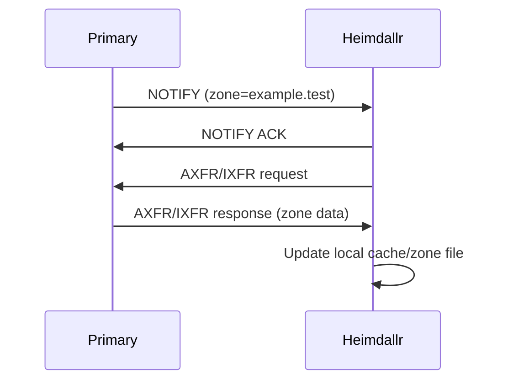

# M2 Authoritative Zones + Transfers Architecture

## Overview

The M2 milestone introduces authoritative DNS zone management. This includes support for Primary and Secondary zones, zone file loading, AXFR/IXFR transfers, and NOTIFY mechanisms as specified in [ROADMAP.md](ROADMAP.md).

## Architectural Components

- **Zone Registry:** A central manager that loads zone files and registers them into the `hickory-server` `Catalog`.
- **Primary Zone Authority:** Implementation of `ZoneHandler` that provides authoritative answers for managed primary zones and supports `AXFR` requests.
- **Secondary Zone Authority:** Implementation of `ZoneHandler` that acts as a secondary server, maintaining a local copy of a zone by syncing from a primary via `AXFR`/`IXFR` and reacting to `NOTIFY`.
- **Transfer Manager:** A background task for each secondary zone to initiate transfer requests and periodically poll for updates.

## Workflow Diagrams

### Secondary Zone Sync

## Next Steps

1. Implement AXFR client logic in `src/core/zone/secondary.rs`.
2. Integrate NOTIFY handling in `src/core/zone/notify.rs`.
3. Update `ZoneManager` in `src/core/zone/mod.rs` to register these handlers.
4. Implement catalog zone management (`RFC 9432`).
