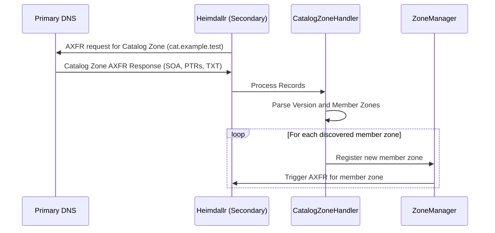

# RFC 9432 (Catalog Zones) Design for Heimdallr

## Overview
Catalog zones (RFC 9432) allow a DNS operator to manage a large set of member zones dynamically. Rather than configuring each secondary zone individually, the secondary server subscribes to a single catalog zone. Adding or removing member zones in the catalog zone triggers the secondary server to dynamically spawn or tear down corresponding secondary member zones.

This is a critical enterprise-grade feature that brings Heimdallr closer to feature parity with Technitium.

## Catalog Zone Schema (RFC 9432)

A catalog zone contains standard resource records structured to represent catalog properties and member zones:

1. **Catalog Version:**
   `version.<catalog-zone> TXT "2"` (RFC 9432 specifies version 2)

2. **Member Zone Entry:**
   `<unique-id>.zones.<catalog-zone> PTR <member-zone-name>`
   Where `<unique-id>` is a unique label representing the member zone (typically a cryptographic hash or random label).

3. **Primary Property (Optional):**
   `primaries.<unique-id>.zones.<catalog-zone> A <ip-address>`
   Specifies the IP addresses of the primary DNS servers for that specific member zone.

## Workflow

## Architectural Components

1. **`CatalogZoneHandler`:**
   Responsible for tracking a configured catalog zone, performing AXFR queries to sync the catalog, and parsing the catalog records to extract member zones and their properties.

2. **Dynamic Catalog Updates:**
   As Heimdallr's `Catalog` structure is owned by `ZoneManager`, we will design a thread-safe update channel or an `Arc<RwLock<Catalog>>` representation to allow `CatalogZoneHandler` to dynamically insert or remove zone handlers.

## Next Actionable Steps

- [x] Define `CatalogZoneHandler` struct in `src/core/zone/catalog.rs`
- [ ] Parse catalog zones from config and instantiate handlers
- [ ] Implement PTR parsing for member zones under `<unique-id>.zones.<catalog-zone>`
- [ ] Implement primary property extraction
- [ ] Hook secondary sync loop to pull member zones dynamically
- [ ] Write integration and unit tests for Catalog parsing
